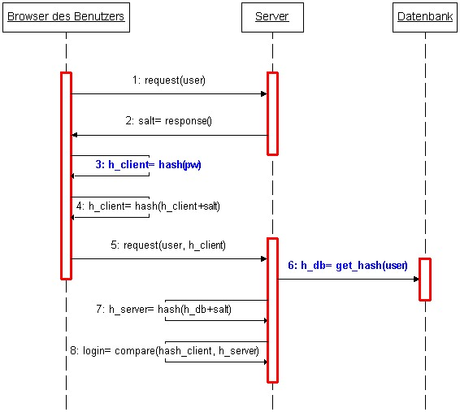

# A brief introduction to salted hash authentication
### (Plus a practical demo for salted hash sha256 authentication with AJAX)

Michael Beyer, 2006/07, rev. 0.2 (revised 2018/01/17)
 
<mgbeyer@gmx.de>

 

Why is authentication against a password hash alone a security risk? How does a more secure approach - the "salted hash" authorization - looks like in practice? What is a typical authorization sequence utilizing the salted hash approach? And how come this procedure is safe? This is not intuitively obvious at first sight.

Those were the kinds of questions which came to my mind over 10 years ago, when I was in the process of writing my diploma thesis dealing with web application security and different attack vectors. The salted hash approach for authentication was just a tiny fraction in a single chapter in my 140 pages mini book I wrote back then. There was just a sequence diagram and a small passage of explanatory text to convey the notion what salted hash authentication means in theory. A real-life code example followed only after over a year later when I first needed practical salted hash authentication for one of my own software projects.

Today this combination, a theoretical introduction and hands-on code examples, is still not outdated, at the very least not on a conceptual level. I recently came across both parts when I was looking for something completely different on one of my older hard drives. So I thought: "Why let this rot in the dark with no use to it at all? Maybe someone out there could benefit from the information. It's presented quite clearly and the examples are solid and simple to grasp". So I decided to clean things up a bit and put all this on my GitHub account...

 
### Salted hash authentication - the procedure [(^)](#_top)
 

>**_Authentication against plain-text passwords is a security risk_**
  

Better store an encrypted representation of a password in your database (using a hash function) to prevent credential theft. But this alone won't mitigate against the vulnerability to man-in-the-middle attacks. An attacker could easily intercept the transmitted hash value and use it for authentication ("spoofing"). In this case a hash value would be nothing but a surrogate for a plain-text password. Instead a "salted" hash approach should be used to address the risk of "spoofing".

 

  

>**_The salted hash authentication sequence_** &nbsp;&nbsp; 
  

After a user request (1) the server first responds by sending a random value to the browser, the so-called "salt" (2). A JavaScript method on the client side computes a hash value based on the user password (3), concatenates it with the "salt" value and from this computes a final hash value (4). Only this final hash value (called "digest") will be sent (along with a user ID) to the server (5). The server then fetches the hash value belonging to the user ID received from a database (6), appends the salt value to it and calculates the final hash value as done before by the client (7). Authentication is successful if both the final hash value from the client (user) and the final hash value from the server match (8).

 
>**_Why is this procedure safe?_**
  

The hash value of the encrypted password alone will never be transmitted between client and server and so interception is impossible (see step 3 in the diagram above). An attacker could intercept the salt value sent by the server. But in order to compute the final hash value needed for authentication the attacker would need the hash value based on the user password which is never transmitted between client and server. The attacker could of course try and intercept the final hash value (digest) transmitted to the server and so hopefully send it to the server in lieu of the legitimate user (so-called "session replay"). But this hash value would be based upon an out-dated salt value stemming from a request-response pair already finalized. Each access request is based on a fresh salt value and so based on a final hash value which is inevitably different from the final hash most recently sent to the server (given the salt is generated in an appropriate manner). Bottom line is: An intercepted digest value would be outdated and thus useless for any potential attacker.

In order to warrant that this procedure is secure, the random "salt" value must be generated in a "cryptographically strong" way, meaning recurrences and predictability of values must be avoided.
 

 
### Salted hash authentication - the German version [(^)](#_top)
 

>**_Die ursprüngliche deutsche Version (anno 2006)_** &nbsp;&nbsp; 
  

Es ist bei einer Authentifikation recht heikel, lediglich gegen den jeweils im Klartext hinterlegten Wert eines Passwortes zu prüfen. Besser ist es, die Passwörter bereits verschlüsselt (bspw. per Hash-Funktion) zu hinterlegen, um Datendiebstahl vorzubeugen. Doch auch dies schützt noch nicht gegen ein Abhören der Leitung (sog. "Man-in-the-middle"). Der übertragene Hashwert eines Benutzers könnte vom Angreifer abgefangen und zur Authentifikation benutzt werden ("Spoofing"). Ein solcher Hashwert wäre in diesem Fall lediglich ein Substitut für ein übertragenes Passwort. Erst eine auf sog. "salted" Hashwerten beruhende Zugriffskontrolle schafft eine gewisse Sicherheit gegen "Spoofing".

Nach einer Benutzeranfrage (1) schickt der Server zunächst einen Zufallswert an den Browser, welcher als "Salt" bezeichnet wird (2). Eine JavaScript-Routine auf Seite des Benutzers errechnet aus dem Benutzerpasswort einen Hashwert (3), hängt an diesen den Salt-Wert an und berechnet aus dem Resultat schließlich einen finalen Hashwert (4). Erst dieser als "Digest" bezeichnete Hashwert wird nun (gemeinsam mit einer Benutzerkennung) zum Server geschickt (5). Der Server liest den zur Benutzerkennung gehörenden Hashwert aus einer Datenbank (6), hängt seinerseits den Salt-Wert an und berechnet ebenso wie der Client zuvor aus dem Resultat den finalen Hashwert (7). Eine Authentifikation findet schließlich statt, sofern die beiden finalen Hashwerte von Client (Benutzer) und Server übereinstimmen (8).

Die Sicherheit dieses Vorgangs liegt darin begründet, daß der unmittelbar aus der Verschlüsselung eines Passwortes hervor gehende Hashwert niemals zwischen Client und Server übertragen wird und somit nicht abgehört werden kann (siehe Schritt 3 in o.g. Schaubild). Ein Angreifer könnte den vom Server übermittelten Salt-Wert mitschneiden, doch um den zur Autorisierung nötigen finalen Hashwert zu erzeugen, fehlt ihm der auf dem Passwort basierende Hash, welcher ja nie übertragen wird. Ein Angreifer könnte natürlich auch den finalen zum Server übertragenen Hashwert (Digest) mitschneiden, in der Hoffnung, ihn im nächsten Schritt seinerseits an Stelle des Benutzers zum Server zu senden (sog. "Session Replay"). Doch dieser Hashwert basiert auf einem alten Salt-Wert, einem längst abgeschlossenen Request-Response-Paar. Denn jeder erneute Zugriff basiert auch auf einem neuen Salt-Wert und damit auf einem Hash, welcher sich unweigerlich vom letzten an den Server geschickten finalen Hashwert unterscheidet (sofern der Salt-Wert aus sicherheitstechnischer Sicht sinnvoll erzeugt wird). Der vom Angreifer abgefangene Digest wäre somit längst veraltet und nutzlos. 

Um die Sicherheit dieses Verfahrens zu gewährleisten, muß der Zufallswert "Salt" aus kryptographischer Sicht "stark" sein, also derart erzeugt werden, daß Wiederholungen und Voraussagbarkeit von Werten vermieden werden.

 
### A little code example [(^)](#_top)

* **sha256hash.js** - JavaScript library to perform sha256 hashing.
* **hashtest.php** - PHP script to demonstrate the equivalence of PHP's hash function and the "sha256hash.js" library.
* **aj_saltedHashServer.php** - A PHP demo application to answer AJAX calls used to demonstrate the salted hash authentication process
* **xmlHttpLib2.js** - a rudimentary light-weight and pure JavaScript AJAX library
* **saltedHashClient.html** - Demonstrate salted hash authentication based on the demo server "aj_saltedHashServer.php" and the "xmlHttpLib2.js" AJAX library.
* **saltedHashClientJQ.html** - Demonstrate salted hash authentication based on the demo server "aj_saltedHashServer.php" and JQuery

